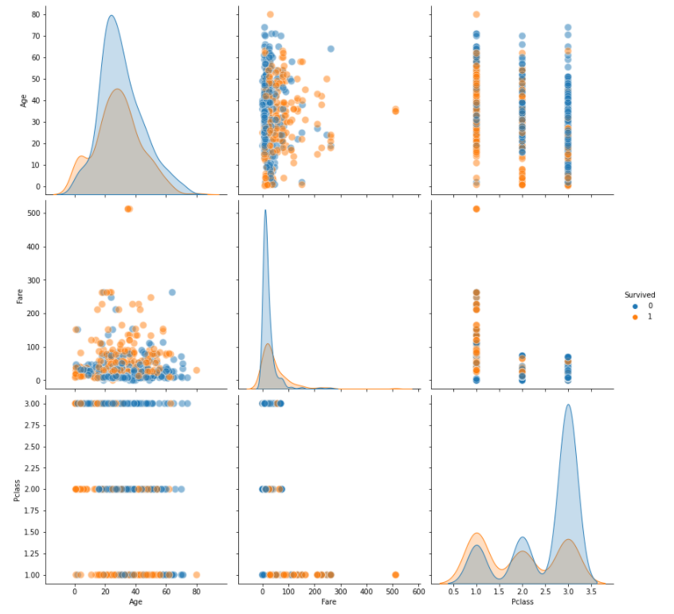
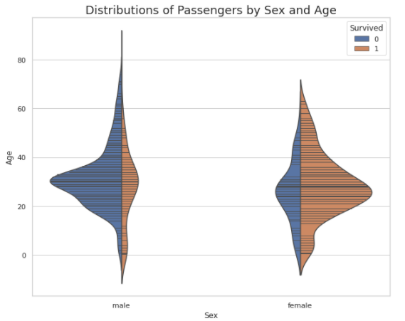
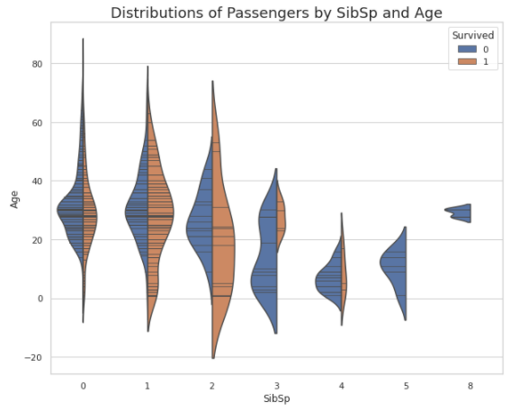
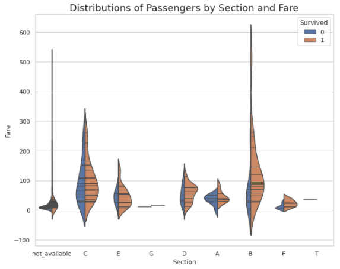
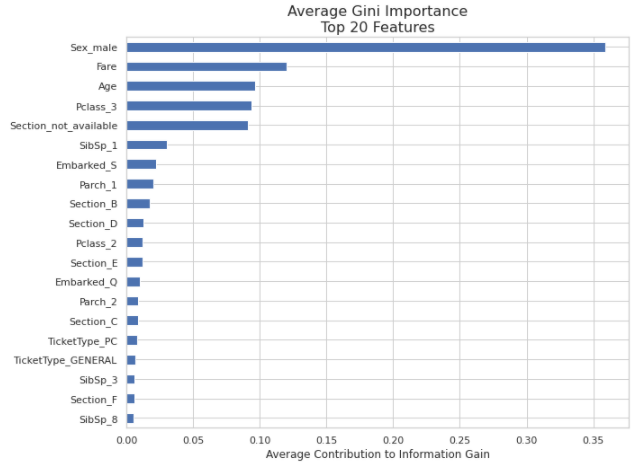

# Kaggle Titanic Challenge
I'm revisiting this challenge because my first submission was pre-my-understanding-of-GitHub. Also, I've learned a lot since that time, some of which I am practicing and demonstrating here. They include:

- Using a class structure for fetching and transforming the data
- Basic feature engineering
- Using `GridSearchCV` to find optimal parameters
- Showing feature importance
- Using the Kaggle API to submit predictions

## Fetching Data
Initialize a TitanicData object and set attributes to begin working with the data. 

> `t = TitanicData()`  
> `t.fetch_data()`  

## Exploratory Data Analysis (EDA)
A few quick plots were executed on the existing numerical data before applying any feature engineering. Generating a Seaborn pairplot is an efficient way to see multiple numerical values plotted against each other. 

Seaborn violin plots are great for examining distributions among two features and the target.

Note: the last violin plot actually had the "Section" feature broken out from Cabin.

## Feature Engineering: First Impressions
Exploratory Data Analysis and intuition suggested some immediate opportunities for transformations in the data:

- Fill null values for Age with the average by gender and embarkation location. 
- There are finite values for Pclass, Sex, SibSp, and Parch, so convert to categorical.
- Cabin flag. My thought here is that passengers were somewhat, if not entirely, segregated. A value for Cabin may be an indicator of this.
- Many values in Cabin lead with an alphabetic character. The character may be an identifier of a Section of the ship. Once Section is broken out, add this to the partition for filling null Age with average.
- Break out LastName from Name.
- Apply MinMaxScaler (after train-test split)

The `set` method tranforms the data according to all but the last of the above. It also applies all transformations to the unseen test set used for submission. 

> `t.set()`  

## Build Input for Model
Select the features to be used in a Random Forest Classifier model by first initializing a ModelInput object with the training and validation data along with the unseen test set. Then, execute the methods that set the features, split the data into the training and test sets, and apply MinMaxScaler. All transformations done to the training and validation sets are also applied to the unseen data. In addition, the unseen data is not used during the training or validation of the model.

> `mi = ModelInput(t.data, t.test_data)`  
> `mi.set_features()`  
> `mi.train_test_split(test_size=0.2)`  
> `mi.scale()`  

# Jupyter Notebook
## Grid Search, Optimal Parameters, and Random Forest Classifier
`random_forest.ipynb` executes all of the above for fetching and transforming the data used to train a Random Forest Classifier. It finds the optimal parameters using `GridSearchCV` and applies those parameters to the final model that are used to make predictions on the unseen data.

## Feature Importance
In plotting the feature importance, we can see that the top features having an influence on predictions are Sex, Fare, Age, and Pclass.

It's important to note that the first feature shown here, `Sex_male`, does not imply that males were more likely to survive than females. The `pandas.get_dummies` method with `drop_first=True` chose to use `male` as the positive class. Feature importance here is merely communicating that splits on `Sex_male`, which only has two values - 1 or 0 - is a major contributor to the information gain in this Random Forest Classifier. To get a better idea of which of the two values is the better predictor for whether one survived (i.e. `Survived == 1`), we could include something like [SHAP](https://github.com/slundberg/shap) in additional analyses.

# Afterword
When applying the optimized parameters that resulted from grid search to the training set, we ended up with a pretty decent accuracy of 0.855. However, when creating predictions from the unseen data, the submission returned an accuracy score of 0.778. This is a significant difference from our cross-validation. Also, the optimized `max-depth` parameter that resulted from grid search was 7 when we have 55, mostly categorical, features. 

A max_depth of 7 in a Random Forest Classification model is, in my experience, suggestive of overfitting. The difference in the scores seems to support that. There are a few things that come to mind that could mitigate this - one of them being a model other than the Random Forest Classifier.  I might attack this at a later date.
